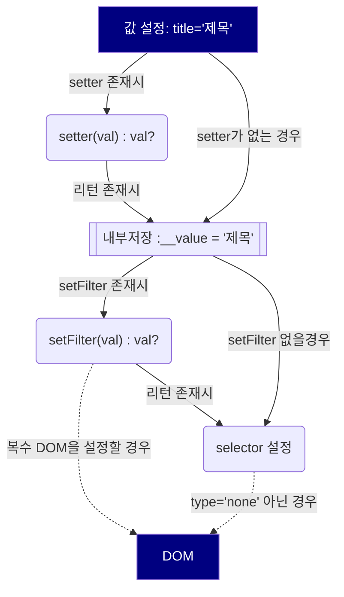

# bind-model
바인드 모델

----------------------------------------
File                                     | % Stmts | % Branch | % Funcs | % Lines | Uncovered Line #s                                                           
-----------------------------------------|---------|----------|---------|---------|--
All files             |   37.76 |    23.59 |   43.79 |   43.12 |                                                                                                                                                               
 base-bind.js         |   76.08 |    60.71 |   88.88 |   85.36 | 27-30,92,152                                                                                                                                                  
 bind-command-ajax.js |   59.34 |    42.59 |   84.61 |   66.44 | 39-44,99-100,132-133,148-150,225,233-237,243-245,271-274,308-310,319-334,342,354-360,388-402,416                                                              
 bind-command.js      |   49.11 |    36.11 |   61.29 |   58.06 | 45-52,115,118,129-130,143-144,158-159,173-174,205-206,220-221,235-236,250-251,265-266,288,337,340,349,354-362,379,397,406,418-436,450-504,520,541             
 bind-model.js   |   33.33 |       25 |   54.54 |   38.34 | 43-50,156,168,194-236,258-369,384,389,412-446,459-460                                                                                                         
 bind-model.js        |   27.21 |     9.19 |   26.82 |   31.78 | 49-58,117-120,132-135,147-150,178-181,193-196,210-211,225-226,240-241,255-256,270-271,306-329,338,346,354,371,393-433,447-462,489-525,542-579,593,607-735,749 
 html-column.js       |   21.17 |    11.97 |   13.63 |   24.16 | 27-29,62-66,78-81,93-96,108-111,132-143,155-158,170-173,190-341,356-359,382-401,448-449                                                                       
 i-bind-model.js      |   38.46 |       75 |      25 |      40 | 90-267,298                                                                                                                                                    
 util.js              |       0 |        0 |       0 |       0 | 6-81                               
----------------------------------------

## 커버리지 비율
    - before                55% | 39%
    - 24년 04월 08일        : 58% | 44%
    - 24년 04월 08일        : 71% | 59%
    - 24년 04월 09일        : 77% | 65%
    - 24년 04월 10일        : 78% | 66%
    - off 
    - 24년 04월 12일(3.5)   : 79% | 67%  
    - 24년 04월 13일(3.5)   : 80% | 69%  
    - 24년 04월 14일(3.0)   : 83% | 73%  
    - 24년 04월 15일(3.0)   : 84% | 73%  
    - 24년 04월 16일(6.0)   : 86% | 76%  
    - off 
    - 24년 04월 18일(5.0)   : 86% | 76%  
    - 24년 04월 19일(5.0)   : 86% | 76%  
    -
    - 24년 04월 21일(3.0)   : 89% | 81%  
    - 24년 04월 24일(5.0)   : 96% | 92%  
    - 손가락 부상으로 휴식 중
    - 문서화 작업중
    

    https://github.com/felixge/node-style-guide 

작동됨

...
..
..
.

TODO: command [] 배열을 전체 추가에서 >> '$all' 으로 변경 요망,  배열타입만 가능
TODO: command 객체에 views 추가 속성 기능 추가 => cmd, views 는 쌍으로 동작하므로, views 입력하지 않으면, 모든 곳에 추가

TODO: addColumm(string ) 타입 추가, string 입력시 빈 컬럼 추가함

TODO: BaseBindCommand.prototype.addColumn 추가시 중복에 대한 이슈 확인

TODO: columns >> cols  별칭 검토

